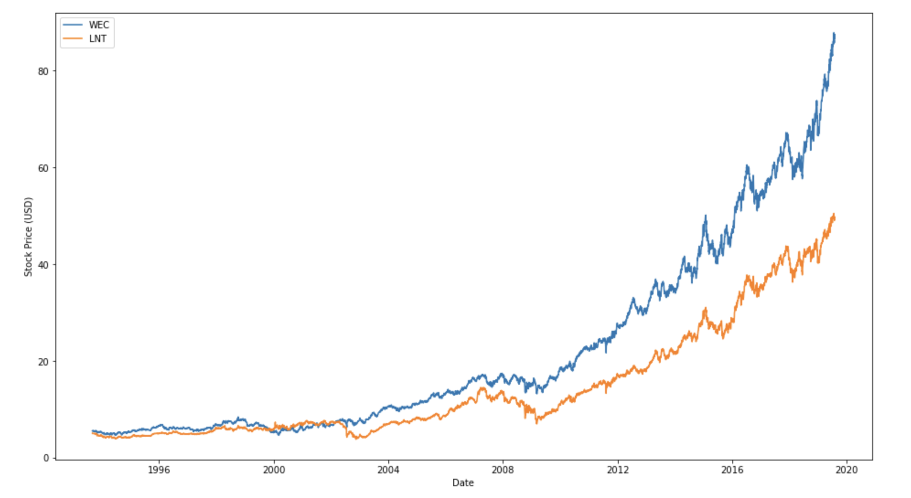
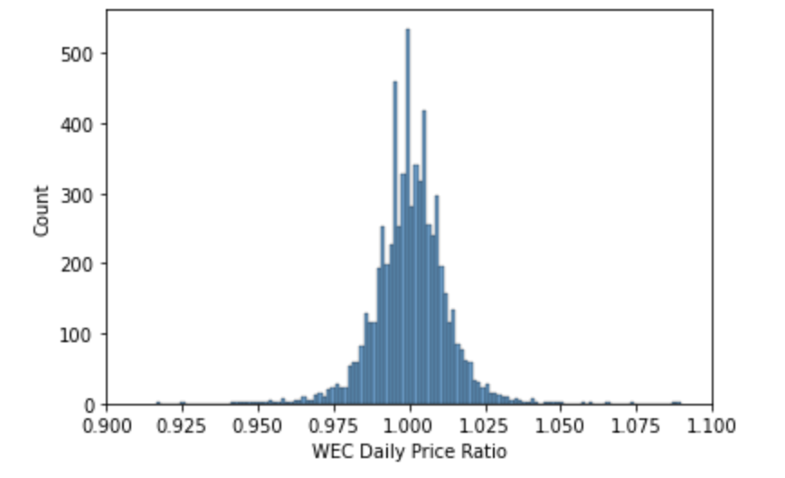

# 📊 Optimising Stock Portfolios

This repository contains my Python project for exploring historical stock price data and preparing it for portfolio optimisation analysis. The project uses **Pandas**, **NumPy**, **Matplotlib**, and **Seaborn** to clean stock time series data, remove problematic tickers, compare stock price behaviour, and analyse daily return distributions and correlations.

The workflow focuses on identifying clean and usable stock series before portfolio construction by checking continuity, removing missing-value issues, comparing return behaviour, and exploring relationships between different assets.

---

## 📌 Introduction

This project explores historical adjusted stock prices and prepares them for portfolio optimisation.

Using a dataset of stock prices over time, I cleaned the data, converted date fields, removed stocks with missing internal values, examined daily return behaviour, and compared assets using correlation and return-based statistics. The project also includes visual analysis of price trends and daily price ratio distributions.

This project demonstrates practical skills in:

- financial data cleaning
- time series preprocessing
- stock return calculation
- missing value filtering
- outlier filtering
- correlation analysis
- distribution analysis
- portfolio preparation in Python

---

## 💡 Motivation

Portfolio optimisation depends on having reliable historical return data. Before building an investment strategy, it is important to:

- clean stock price series
- remove assets with incomplete internal histories
- compare return stability across stocks
- understand correlations between assets
- inspect distributions of daily price changes

The goal of this project is to create a cleaner and more reliable stock universe for later optimisation work and to better understand how individual assets behave over time.

---

## 📂 Dataset Description

The project uses a CSV dataset:

- `adjprice.csv`

This file contains historical adjusted stock prices for multiple tickers, along with a numeric date column.

The notebook performs several transformations on the raw data:

- converts numeric dates into Python date format
- removes the `" US Equity"` suffix from ticker names
- drops rows where all stock values do not change, which helps remove weekend-style non-trading rows
- removes stocks with missing values inside their active trading range

The final cleaned dataset is then used for return and correlation analysis.

---

## 🧪 Tools and Libraries Used

This project was built using:

- **Python**
- **Pandas**
- **NumPy**
- **Matplotlib**
- **Seaborn**
- **datetime**
- **time**
- **random**
- **numba** (imported in the notebook)

These libraries support time series cleaning, return calculations, statistical analysis, and visualisation.

---

## 🧹 Data Preparation Workflow

### 1. Load the stock price dataset
The project reads adjusted stock prices from:

- `adjprice.csv`

### 2. Convert numeric dates
The raw date values are converted into proper Python `datetime.date` values using a helper function.

### 3. Standardise ticker names
The notebook removes the `" US Equity"` suffix from ticker names so the column names are shorter and easier to use.

### 4. Remove non-trading rows
Rows where all stock prices remain unchanged from the previous row are dropped. This helps remove non-informative rows, such as weekend-like gaps.

### 5. Remove stocks with missing interior values
Some tickers contain missing values inside their trading history. These tickers are removed to ensure that the remaining stock series are more suitable for return analysis and portfolio work.

### 6. Compute daily price ratios
The notebook defines a helper function:

- `ddt(a)`

This computes the daily price ratio from one trading day to the next. These price ratios are then used to analyze return behaviour across different stocks.

### 7. Compute stock-level statistics
For each ticker, the notebook calculates:

- geometric mean daily ratio
- standard deviation of daily price ratios

These statistics are used to compare expected growth behaviour against volatility.

### 8. Remove outlier tickers
Tickers with unusually extreme normalized mean or standard deviation values are treated as outliers and removed from the cleaned stock universe.

---

## 🔍 Analysis Performed

The notebook includes several analysis steps to better understand the stock dataset before portfolio optimisation.

### 1. Correlation analysis
A correlation matrix is created across all stocks in the cleaned dataset. This helps identify pairs of stocks that move similarly over time.

### 2. Correlation pair ranking
The project builds pairwise correlations between tickers and sorts them to find the strongest stock-to-stock relationships.

### 3. Price trend comparison
The notebook compares historical prices of selected stocks, such as:

- `WEC`
- `LNT`

This provides a simple example of how two stocks evolve over time.

### 4. Daily price ratio distribution
The project visualises the distribution of daily price ratios for selected stocks such as `WEC`.

This helps show how most daily price movements are concentrated around 1.0, with relatively fewer extreme days.

### 5. Mean vs standard deviation filtering
Stocks are compared using:

- geometric mean daily ratio
- standard deviation of daily price ratios

This supports outlier detection and helps define a cleaner set of stocks for future portfolio analysis.

---

## 📊 Key Visualisations

### 1. Historical Stock Price Comparison



This chart compares the historical adjusted stock prices of **WEC** and **LNT** over time. Both stocks show a long-term upward trend, but **WEC** grows more strongly and reaches a higher final price level. The visual helps compare long-run stock performance and shows how two relatively similar assets can still differ in growth path and magnitude.

### 2. WEC Daily Price Ratio Distribution



This histogram shows the distribution of daily price ratios for **WEC**. Most daily movements are tightly concentrated around **1.0**, which means that on most trading days the stock changes only by a small percentage. The narrow and centered shape is useful for understanding volatility and daily return stability.

---

## 📈 Main Insights

The project reveals several useful findings:

- stock price data needs careful cleaning before portfolio analysis
- removing stocks with missing internal histories improves data reliability
- many daily stock price ratios are clustered close to **1.0**
- selected stocks such as **WEC** and **LNT** show strong long-term growth, but not at the same rate
- correlation analysis helps identify assets that move similarly
- mean and standard deviation of daily ratios can be used to detect unusual or unreliable tickers

Overall, the project shows that data preparation is a critical step before any portfolio optimisation process.

---

## 🛠️ Techniques Used

This project demonstrates the use of:

- CSV loading with `read_csv()`
- custom date parsing
- string-based column renaming
- row filtering
- missing value filtering
- daily ratio calculation
- geometric mean calculation
- standard deviation analysis
- normalization of summary statistics
- outlier detection
- correlation matrix generation
- pairwise correlation ranking
- time series plotting
- histogram visualisation

---

## 📁 Files

- `Optimising Stock Portfolios.ipynb` – Jupyter notebook containing the full stock analysis workflow
- `adjprice.csv` – historical adjusted stock price dataset
- `Screenshot 2026-04-09 at 10.38.05 pm(1).png` – historical price comparison visualisation
- `Screenshot 2026-04-09 at 10.38.21 pm(1).png` – WEC daily price ratio distribution visualisation

---

## ▶️ How to Run the Project

1. Open the notebook in **Jupyter Notebook**, **JupyterLab**, or **VS Code**
2. Make sure `adjprice.csv` is in the same working directory
3. Install the required libraries if needed:

```python
pip install pandas numpy matplotlib seaborn numba
